<!-- _class: title-slide -->

# OpenClawとは

## 常駐型AIアシスタント基盤を理解し、社内活用につなげる

<div class="subtitle">社内エンジニア勉強会 / 20分</div>

---

# 今日のゴール

## 聞いた後に説明できるようになること

1. **OpenClawは何をするもので、ChatGPT / Coding Agent と何が違うか**
2. **Gateway / チャネル / セッション / メモリ / ツールの役割**
3. **社内のどこから使い始めるのが現実的か**

<div class="note">インストール手順や個別機能の使い方ではなく、「OpenClawをどう捉え、どう社内に置くか」に焦点を当てます。</div>

---

# なぜいま OpenClaw か

## 公開から半年で、世界規模で広がっている

<div class="three-columns">
<div class="card center">
<span class="big-stat">374,956</span>
<span class="stat-label">GitHub ⭐ Stars</span>
</div>
<div class="card center">
<span class="big-stat">78,134</span>
<span class="stat-label">Forks</span>
</div>
<div class="card center">
<span class="big-stat">363+</span>
<span class="stat-label">Contributors</span>
</div>
</div>

- **初回コミットは2025年11月** — わずか半年で37万スター超え
- **LiteLLM 公式ドキュメント**に OpenClaw 連携手順が掲載されるなど、エコシステムとの統合が進む
- 第三者による解説記事・テンプレート集も次々登場

<div class="source">出典(2026-05-27時点): <a href="https://github.com/openclaw/openclaw">github.com/openclaw/openclaw</a> (GitHub API) / <a href="https://docs.litellm.ai/docs/tutorials/openclaw_integration">LiteLLM公式 連携ドキュメント</a></div>

<div class="message">マニアックなOSSではなく、世界のエンジニアが既に乗っている流れ。</div>

---

# 特に中国で「ロブスター熱狂」

## Bloomberg・日経・MIT Tech Review が相次いで報道

<div class="two-columns">
<div class="card">

### 中国市場の動き

- **Alibaba / Tencent / ByteDance** が関連製品を投入
- 地方政府が**最大500万元の補助金**(深セン市など)
- インストール代行業・中古Mac販売など**周辺ビジネスが誕生**
- **中国当局(CNCERT)** が注意喚起を発令

</div>
<div class="card">

### 主要メディアの取り上げ

- **Bloomberg**: 中国の "Lobster Craze" を複数記事で特集
- **MIT Tech Review**: 副業ラッシュを取材
- **日経新聞**: 中国当局の注意喚起を報じる
- 開発者 Steinberger 氏は **OpenAI に入社**

</div>
</div>

<div class="source">出典: <a href="https://www.bloomberg.com/news/articles/2026-03-11/what-is-the-openclaw-ai-agent-and-why-is-it-popular-in-china">Bloomberg "Why Is It Popular in China"</a> / <a href="https://www.technologyreview.jp/s/379233/hustlers-are-cashing-in-on-chinas-openclaw-ai-craze/">MIT Tech Review 日本版</a> / <a href="https://www.nikkei.com/article/DGXZQOGM176Z10X10C26A3000000/">日本経済新聞</a></div>

<div class="message">国家規模・大手企業・主要メディアが既に動いている。観察フェーズはもう終わっている。</div>

---

# 一言でいうと

## AIアシスタントを自分の環境に常駐させるためのGateway基盤

<div class="three-columns">
<div class="card">

### ChatGPT

完成済みの**チャットAIサービス**。
画面を開いて会話する。

</div>
<div class="card">

### Claude Code / Codex

開発者個人の**コーディング体験**が主役。
CLI / IDE が入口。

</div>
<div class="card">

### OpenClaw

**AIアシスタントを常駐配置する基盤**。
複数の入口・文脈・ツールを束ねる。

</div>
</div>

<div class="message">OpenClawはモデルそのものではなく、AIをどこに置き、どこから呼び出し、どの文脈で動かすかを扱う。</div>

---

# 全体像

## Gatewayが入口とエージェントをつなぐ



<div class="message">中心はLLMではなくGateway。入口・文脈・実行手段を交通整理する。</div>

---

# 構成要素の役割

## 1枚で押さえる

| 要素 | 役割 | 具体例 |
|---|---|---|
| **Gateway** | 依頼を受け取り、文脈を特定し、エージェントへ橋渡し | 常駐プロセス。複数チャネル・複数セッションを集約 |
| **チャネル** | ユーザーがAIに話しかける入口 | Web Dashboard / CLI / TUI / Chat (Slack等) |
| **セッション** | どの会話の続きとして扱うかの単位 | 個人DM / グループ / チャンネルごと / Webhook |
| **メモリ** | 過去の文脈を引き継ぐための記憶 | 長期メモ / 会話履歴 / 作業ログ |
| **ツール / スキル** | AIに作業手段を与える部品 | ファイル操作 / シェル / API / MCP連携 |
| **サンドボックス** | ツール実行を隔離し、影響範囲を閉じ込める仕組み | コンテナ内で実行 / 権限制御 / 危険操作の遮断 |

---

# Claude Code / Codex と何が違うのか

## 似ているのはツール実行部分。主役が違う

| 観点 | Claude Code / Codex | OpenClaw |
|---|---|---|
| 設計の主眼 | 開発者個人のコーディング体験 | 社内チャネル常駐の業務エージェント |
| 想定利用者 | 開発者(IDE / CLIから) | 業務担当者(チャット / Web UIから) |
| 拡張方式 | MCP等で接続可能(個人セットアップ前提) | コンテナ常駐＋社内チャネル接続を前提に設計 |
| 主な呼び出し導線 | ターミナル / IDE | Symphony等の社内チャット / Web UI |
| 強み | コーディング体験の完成度 | 閉域運用・チャネル統合・常駐化のしやすさ |

<div class="message">開発者個人のコーディングなら Claude Code / Codex。社内チャネルに常駐させる業務エージェントなら OpenClaw。</div>

---

# 動かすイメージ

## チャットから依頼すると、Gatewayがどう動くか

<div class="two-columns">
<div>

### 流れ

1. ユーザーがチャネル(例: Symphony)に依頼を投稿
2. Gatewayが受信し、**どのセッション**かを特定
3. 関連する**メモリ**をロード
4. AIエージェントがLLMに問い合わせ、**ツール**を実行
   - GitLabを読む / 共有フォルダを検索 / Obsidianを参照
5. 結果を整形し、**元のチャネル**に返す

</div>
<div>

```text
[Symphony DM] @assistant
"先週の障害対応メモを要約して"
        │
        ▼
   OpenClaw Gateway
   ├─ session: user-A / DM
   ├─ memory: 過去の会話・作業ログ
   ├─ tools : obsidian_search, fs_read
   └─ LLM   : 要約・整形
        │
        ▼
[Symphony DM] 返信:
"先週の障害対応(3件)の要約は…"
```

</div>
</div>

<div class="message">「AI専用画面を開く」のではなく「普段の場所にAIがいる」体験になる。</div>

---

# 今回のPoC構成

## 社内環境で動かしている形

```text
Symphony
  ↓
Python Bridge
  ↓
OpenClaw Container
  ↓
LLM API

OpenClaw Container
  ├─ GitLab
  ├─ Shared Folder
  ├─ Obsidian Vault
  └─ Local Tools / Scripts
```

<div class="small">

前提:
- OpenClawはコンテナ内の閉鎖環境で稼働
- LLM APIへのアップロードは了承済み
- 当部は投資部門であり、顧客情報を直接扱う環境ではない
- まずは読み取り系を中心に検証

</div>

---

# ライブデモ

## 社内情報を横断してPoC状況を整理する

<div class="message">これからOpenClawに以下のプロンプトを実際に投げます。</div>

### 入力プロンプト

```text
OpenClaw PoCの現状を、新しく参加した人向けに説明できるようにまとめてください。

以下の情報源を確認してください。
- GitLabのREADME、Issue、最近のcommit
- Obsidian Vault内の設計メモ
- 共有フォルダ内の説明資料

まとめる観点は以下です。
1. PoCの目的
2. 現在の構成
3. できていること
4. 未解決課題
5. 次にやるべきこと
```

---

# 想定アウトプット

```text
OpenClaw PoC 現状整理

1. 目的
- 社内閉域環境でAIエージェント基盤を検証する
- Symphony等の社内チャットから利用できるようにする

2. 現在の構成
- OpenClawはコンテナ内で稼働
- Python BridgeがSymphonyとOpenClawを接続
- GitLab、共有フォルダ、Obsidian Vaultとの連携を検証中

3. できていること
- 単一リポジトリの調査・要約
- Obsidian Vault からの過去メモ参照
- Symphony からの依頼受付と回答返却

4. 未解決課題
- GitLab連携方式の整理(API/SSH/トークン管理)
- 共有フォルダ検索の精度向上
- 長時間タスクの扱い

5. 次にやるべきこと
- 利用ガイド整備と社内トライアル拡大
- アクセス制御・監査ログの設計
- 評価指標(成功率・所要時間)の取得
```

**単なる要約ではなく、複数情報源から業務文脈を復元する。**

---

# PoCで分かったこと

## 効いた / 効かなかった / 詰まった

| 区分 | 内容 |
|---|---|
| 効いた | 単一リポジトリの調査・要約 / Obsidianの過去メモ突合 / 新規参加者向けのオンボーディング素材生成 |
| 効かなかった | 大規模な共有フォルダの全文横断検索(精度・速度ともに不足) |
| 詰まった | GitLabの認証・スコープ設計 / 長時間タスクのタイムアウトとリトライ / 出力の事実確認コスト |

<div class="message">「読み取り＋整理」は想定以上に効く。「探索＋判断」は人間のレビューが要る。</div>

---

# 社内で効くユースケース

## 情報検索ではなく、業務文脈の再構成

| ユースケース | できること |
|---|---|
| GitLab調査エージェント | 関連リポジトリ、最近の変更、影響範囲を整理 |
| 共有フォルダ探索エージェント | 過去資料、最新版、流用可能な資料を探す |
| Obsidian Vault整理エージェント | 過去メモ、検討経緯、未解決課題を整理 |
| Symphony連携エージェント | チャットから依頼し、元のチャットへ回答を返す |
| オンボーディング支援 | 新規参加者向けに散在資料を集約・要約 |

<div class="message">単独の情報源を見るより、複数を横断するほどOpenClawの価値が出る。</div>

---

# どこから始めるべきか

## いきなり「全部任せる」は危険

| 始めやすい領域 | 後回しにした方がよい領域 |
|---|---|
| 読み取り専用 | 本番環境の変更 |
| 調査補助 | 自動デプロイ |
| 要約 | Git push |
| 影響範囲整理 | 権限の強い操作 |
| 手順書作成 | 外部送信を伴う処理 |
| 新規参加者向けオンボーディング | 重要判断の自動化 |

<div class="message">最初に任せるべきなのは、判断や変更ではなく、調査と整理。</div>

---

# 注意点

## 常駐させるからこそ、設計が効いてくる

OpenClawは設定次第で外部サービスやローカル環境に触れる。常駐させる前に次を決める。

- **誰が**話しかけられるか(チャネルごとの認証・許可)
- **どのチャネル**から使えるか(社外チャットからの導線は閉じるか)
- **どのツール**を実行できるか(読み取り専用 / 書き込み)
- **どの情報**がLLMへ渡るか(機密・PIIフィルタ)
- **実行前に人間確認**を挟むか(破壊的操作の前にレビュー)

<div class="message">便利さと危険さは同じ蛇口から出る。入口・権限・実行範囲の設計が重要。</div>

---

# まとめ

1. OpenClawはAIモデル本体ではなく、**AIアシスタントを常駐させるGateway基盤**
2. 主要要素は **Gateway / チャネル / セッション / メモリ / ツール**
3. Claude Code / Codex と似たツール実行はあるが、主役は**社内チャネル常駐の業務エージェント**
4. PoCで効いたのは**読み取り＋整理**。最初は**調査・要約・オンボーディング**から
5. 常駐化するほど、**入口・権限・実行範囲の設計**が重要になる

<div class="message">OpenClawは、AIに丸投げするためではなく、社内に散らばった情報をつなぎ、人間の判断を助けるための作業基盤。</div>

---

# 議論したいこと

## 皆さんの業務で、AIが読めるようになると嬉しい社内情報源は?

- GitLab?
- 共有フォルダ?
- 手順書?
- Obsidian?
- 過去の障害対応メモ?
- 定例資料?

<div class="message">まず読み取り専用で任せるなら、どの作業が安全で効果が大きいか。</div>

---

# 想定Q&A

| 観点 | 現時点の答え |
|---|---|
| セキュリティ・監査 | コンテナ閉域稼働。アクセス制御・操作ログの設計はPoC後の課題として認識。PII/機密のフィルタリングは今後整備 |
| データ送信 | LLM APIへの送信は了承済み範囲。投資部門のため顧客情報は直接扱わない前提 |
| コスト | 主要コストはLLM API利用料。読み取り中心の運用なら1ユーザーあたり月額数千円〜数万円のオーダー想定(要実測) |
| 代替案との比較 | Dify / LangChain / n8n / M365 Copilot等も検討対象。OpenClawはコンテナ常駐＋社内チャネル統合の柔軟さで選定 |
| 失敗時の影響 | 読み取り専用運用が前提のため、誤回答が出ても人間のレビューで吸収可能 |
