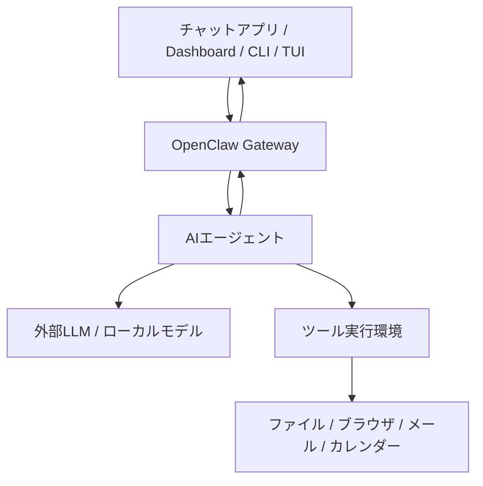
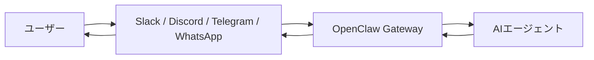

<!-- _class: lead -->

# OpenClaw入門

## ChatGPTとの違いから、常駐AI秘書の仕組みを理解する

社内エンジニア勉強会 / 20分

---

# 今日のゴール

## OpenClawとは何かを、まず正しく捉える

この資料で扱うこと：

1. OpenClawとChatGPTの違い
2. OpenClawが「AI本体」ではなく「Gateway」であること
3. セッション、メモリ、チャネル、ツールの考え方
4. 常駐AI秘書として何ができるのか
5. 安全に使うための注意点

OpenClawは、AIに質問するアプリではなく、AIエージェントを自分の環境に常駐させる基盤。

---

# OpenClawとは

## セルフホスト型のAIアシスタント基盤

OpenClawは、普段使っているチャットアプリなどからAIに指示し、設定した権限やツール連携に応じて作業させるための基盤。

扱えるものの例：

- チャットアプリからの指示
- メール、カレンダー
- ブラウザ
- ファイル操作
- 定期実行
- ツール連携

ChatGPTが「AIと会話する場所」なら、OpenClawは「自分の環境に常駐するAI秘書を作る仕組み」。

---

# ChatGPTとの違い

## ChatGPT

- 完成済みのAIサービス
- 画面を開いてAIと会話する
- 文章、コード、調査、要約、ファイル分析などを扱える
- すぐに使えることが強み

## OpenClaw

- AIアシスタントを動かす基盤
- チャネル、スキル、メモリ、ツールを組み合わせる
- 自分の用途に合わせて設計する
- 常駐エージェントとして動かせる

ChatGPTは「会話・作業支援のサービス」。OpenClawは「実行型エージェントの基盤」。

---

# OpenClawはAI本体ではない

## 重要なのはGatewayという考え方

OpenClaw自体は巨大なAIモデルではない。

外部LLM、ローカル/クラウドのモデル設定、チャットチャネル、ツール実行環境を組み合わせて、AIアシスタントを動かす基盤。

---

# Gatewayの役割

## セッション、ルーティング、チャネル接続を管理する制御プレーン

Gatewayが行うこと：

- SlackやDiscordなどから届いたメッセージを受け取る
- どの会話の続きかを判断する
- 適切なAIエージェント、スキル、ツールへ振り分ける
- 処理結果を元のチャットへ返す

OpenClawは、いろいろなチャットアプリをAIの受付窓口に変えるルーターのようなもの。

---

# OpenClawの体験

## 新しいAIアプリを開くのではなく、普段の場所にAIがいる

ユーザーは、ChatGPTの画面を開く代わりに、普段使っているチャット空間からAIに話しかける。

OpenClawの面白さは、AIが普段の会話空間に常駐する体験にある。

---

# セッション

## AIが「どの会話の続きか」を判断する単位

OpenClawでは、会話はセッションとして管理される。

ChatGPTのチャットスレッドに近いが、複数のサービスから話しかけられるため、考え方が少し違う。

セッション分離の例：

- DM
- グループチャット
- ルーム / チャンネル
- 定期実行
- Webhook経由の処理

複数の入口があるからこそ、文脈が混ざらないようにセッション設計が重要。

---

# チャネルとセッションの違い

## 「チャネル」はAIに接続する入口

OpenClawでいうチャネルは、AIに接続するサービスのこと。

例：

- Slack
- Discord
- Telegram
- WhatsApp
- Dashboard
- CLI / TUI

一方で、Slackのチャンネルは `#general` や `#project-a` のような、Slack内の会話場所を指す。

OpenClawでは、送信元チャネル、送信者、アカウントなどをもとにセッションを分けられる。

---

# メモリ

## エージェントが作業を継続するためのノート

OpenClawのメモリは、エージェントが作業文脈を引き継ぐための仕組み。

保持するものの例：

- 長期記憶
- 日次メモ
- 作業ログ
- 会話履歴
- 以前の作業文脈

ChatGPTのメモリがユーザーの好みを覚える機能に寄りがちな一方、OpenClawのメモリは作業を継続するための文脈保持に近い。

---

# ツールとスキル

## AIに「できること」を与える仕組み

OpenClawでは、AIにただ返答させるだけでなく、ツールやスキルを通じて作業手段を与える。

例：

- ファイルを読む
- ブラウザを扱う
- メールやカレンダーを見る
- 外部APIと連携する
- 定期的な処理を行う

LLMの知能に、現実の作業環境へ触れる手段を足すのがOpenClawの考え方。

---

# OpenClawの強み

## 普段のチャットアプリから使える

ChatGPTのように専用画面を開くのではなく、仕事やコミュニティで使っているチャットアプリからそのままAIに話しかけられる。

AIが新しい場所にあるのではなく、普段の会話空間に入ってくる。

---

# OpenClawの強み

## 常駐エージェントとして動かせる

OpenClawは、自分のPCやサーバー上で動かすAIエージェント基盤。

必要なときに質問するだけでなく、常に待機させておき、設定したツールや権限の範囲で作業させられる。

例：

- メール
- 予定
- 通知
- ブラウザ操作
- ファイル操作
- 定期実行

---

# OpenClawの強み

## 自分の環境に合わせて拡張できる

OpenClawでは、以下を組み合わせて自分用のAI秘書を作る。

- チャネル
- スキル
- ツール
- メモリ
- MCP
- Webhook

ChatGPTが完成されたAIサービスなら、OpenClawは自分のワークフローに合わせて組み立てるAI作業場。

---

# OpenClawの強み

## チームやコミュニティでも使える

OpenClawは個人用のAI秘書としてだけでなく、Slack BotやDiscord Botのようなチャットエージェントとしても使える。

例：

- チームのSlackに置く
- DiscordコミュニティにAI Botとして参加させる
- チャットからAIに質問できるようにする

ただし、共有利用や複数人利用では追加のロックダウンが必要。

---

# セキュリティ面の注意

## 実際の作業環境に触れるため、権限設計が重要

OpenClawは、設定次第でメール、カレンダー、ファイル、ブラウザ、チャットアプリなどに触れる。

注意点：

- 誰が話しかけられるか
- どのチャンネルで使えるか
- どのツールを実行できるか
- 外部LLM APIへ何が送られるか
- ログ保存、APIキー管理、アクセス権限

安全に使うには、チャネル、ユーザー、ツール、実行範囲を絞り、必要に応じて人間の確認を挟む。

---

# まとめ

## OpenClawとは何か

1. OpenClawは、AIに質問するツールというより、**常駐するAIエージェントを作る基盤**
2. 中心には**Gateway**があり、チャネル、セッション、ルーティング、ツール実行をつなぐ
3. ChatGPTとの違いは、完成済みAIサービスではなく、**自分の環境に合わせて組み立てるAI作業場**であること
4. 普段のチャットアプリや複数の入口から使える
5. 実際の作業環境に触れるため、権限と安全設計が重要

OpenClawは、普段のチャット空間に常駐するAI秘書を、自分の環境で作るための仕組み。

