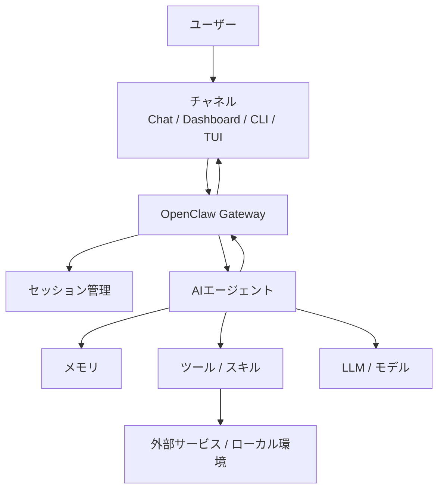
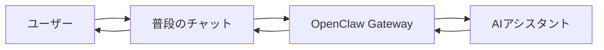

<!-- _class: lead -->

# OpenClaw入門

## ChatGPTの次に来る「常駐AIアシスタント」を理解する

社内エンジニア勉強会 / 20分

---

# 今日の到達点

## 聞いた後に説明できるようになること

この発表では、次の3点を理解することを目標にします。

1. **OpenClawは何をするためのものか**
2. **ChatGPTのようなAIサービスと何が違うのか**
3. **Gateway、チャネル、セッション、メモリがなぜ重要なのか**

この発表では、インストール手順や細かい使い方ではなく、OpenClawという仕組みの捉え方に絞ります。

---

# なぜ分かりづらいのか

## 既存のAIツール分類に収まりにくい

OpenClawは、最初に聞くと少し捉えづらいです。

なぜなら、次のどれか1つに単純分類できないためです。

- ChatGPTのようなチャットAIサービス
- Claude Code / CodexのようなCoding Agent
- Slack BotやDiscord Bot
- MCPクライアント
- ローカル自動化ツール

OpenClawは「AIサービス」ではなく、複数の入口と作業手段を束ねるAIアシスタント基盤として見ると分かりやすい。

---

# OpenClawを一言でいうと

## 自分の環境にAIアシスタントを常駐させるためのGateway

OpenClawは、普段使っているチャットアプリやUIからAIに話しかけ、必要に応じて外部サービスやツールへ橋渡しするための基盤です。

重要なのは、AIモデルそのものではなく、**AIをどこに置き、どこから呼び出し、どの文脈で動かすか**を扱う点です。

OpenClawは、AIを「特定のアプリの中」ではなく「自分の環境の中」に置くための仕組み。

---

# ChatGPTとの違い

## 完成済みサービスか、組み立てる基盤か

## ChatGPT

- 画面を開いてAIと会話する
- サービスとして完成している
- すぐ使える
- 主な入口はChatGPTのUI

## OpenClaw

- AIアシスタントを動かす基盤
- チャネルやツールを組み合わせる
- 自分の環境に合わせて設計する
- 入口を複数持てる

ChatGPTは「使うサービス」。OpenClawは「AIアシスタントを配置する基盤」。

---

# 全体像

## Gatewayが入口とエージェントをつなぐ

OpenClawの中心は、モデルではなくGateway。

---

# Gatewayの役割

## 依頼を受け取り、文脈を特定し、適切な処理に渡す

Gatewayは、OpenClawの中核となる常駐プロセスです。

主な役割は次の通りです。

- チャットアプリやUIからメッセージを受け取る
- どの会話の続きかを判断する
- エージェント、メモリ、ツールへ橋渡しする
- 結果を元の入口へ返す

Gatewayは、AIへの入口、会話文脈、実行手段をつなぐ交通整理役。

---

# チャネル

## AIに話しかける入口

チャネルとは、ユーザーがOpenClawに接続する入口です。

例：

- Dashboard
- CLI / TUI
- Slack
- Discord
- Telegram
- WhatsApp

チャネルがあることで、AI専用画面を開かなくても、普段の会話空間からAIに依頼できます。

OpenClawでは、AIの入口を1つの画面に閉じず、複数のチャネルに広げられる。

---

# セッション

## 会話の文脈を分ける単位

複数の入口からAIに話しかける場合、文脈が混ざらないことが重要です。

セッションは、どの会話の続きとして扱うかを決める単位です。

例：

- 個人DMの会話
- グループチャットの会話
- チャンネルごとの会話
- 定期実行の文脈
- Webhook経由の処理

セッションは、常駐AIアシスタントにとっての「会話の部屋」。

---

# メモリ

## 作業文脈を引き継ぐための記憶

メモリは、AIアシスタントが過去の文脈を引き継ぐための仕組みです。

覚える対象の例：

- 長期記憶
- 日次メモ
- 会話履歴
- 作業ログ
- 過去に決めたこと

メモリは、AIをその場限りの回答者ではなく、継続的に付き合うアシスタントに近づける。

---

# ツールとスキル

## AIに作業手段を与える部品

OpenClawでは、AIに返答させるだけでなく、ツールやスキルを通じて作業手段を与えられます。

例：

- ファイルを見る
- ブラウザを使う
- メールやカレンダーを扱う
- 外部APIへ接続する
- MCP経由で機能を増やす

ツールとスキルは、AIアシスタントに与える「できること」の一覧。

---

# Coding Agentとの位置づけ

## 似ている部分はあるが、主役が違う

Claude CodeやCodexも、ファイル編集やコマンド実行ができます。

そのため、ツール実行だけを見るとOpenClawと似ています。

ただし主役は異なります。

| 観点 | Coding Agent | OpenClaw |
|---|---|---|
| 中心 | 開発作業 | 常駐AIアシスタント |
| 入口 | CLI / IDE | Chat / Dashboard / CLI / TUI |
| 文脈 | リポジトリ | セッション、チャネル、メモリ |
| 目的 | コードを書く・直す | 普段の環境でAIに依頼する |

---

# OpenClawで得られる体験

## AIが普段の会話空間にいる

ユーザーは、AI専用画面を開くのではなく、普段使っている場所からAIに話しかけます。

OpenClawの体験は、AIを呼びに行くことではなく、AIが普段の場所にいること。

---

# OpenClawの強み

## 常駐・複数入口・拡張性

OpenClawの強みは、単体の機能というより、次の性質の組み合わせです。

- AIアシスタントを常駐させられる
- 複数のチャネルから呼び出せる
- セッションで文脈を分けられる
- メモリで継続的な文脈を持てる
- ツールやスキルで作業範囲を拡張できる

OpenClawは、AIを“使う”よりも、AIがいる環境を“設計する”ための基盤。

---

# 注意点

## 実環境に近づくほど、設計が重要になる

OpenClawは、設定次第で外部サービスやローカル環境に触れます。

そのため、次の観点を考える必要があります。

- 誰が話しかけられるか
- どのチャネルから使えるか
- どのツールを実行できるか
- どの情報がモデルへ渡るか
- 実行前に人間確認を挟むか

常駐AIアシスタントは便利な一方、入口・権限・実行範囲の設計が重要。

---

# まとめ

## OpenClawとは何か

1. OpenClawは、AIモデル本体ではなく**AIアシスタントを常駐させるGateway基盤**
2. ChatGPTとの違いは、完成済みサービスではなく**自分の環境に合わせて組み立てる基盤**であること
3. Gateway、チャネル、セッション、メモリ、ツールがOpenClawを構成する主要要素
4. Coding Agentと似ている部品はあるが、主役はコード編集ではなく**常駐AIアシスタント体験**
5. 実環境に近づくほど、入口・権限・実行範囲の設計が重要

OpenClawは、普段の場所にAIアシスタントを置くための仕組み。

